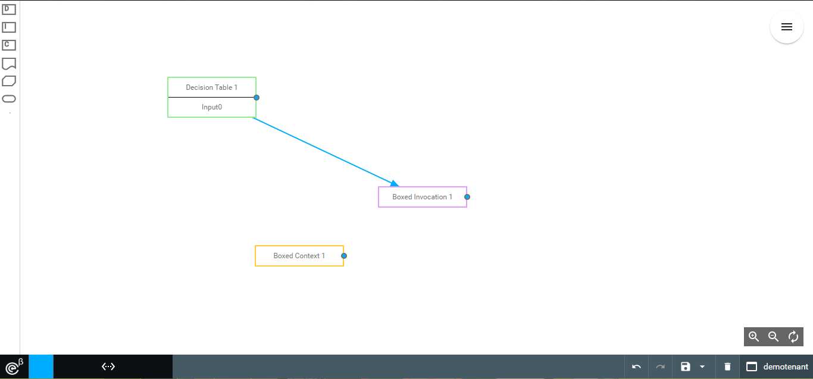
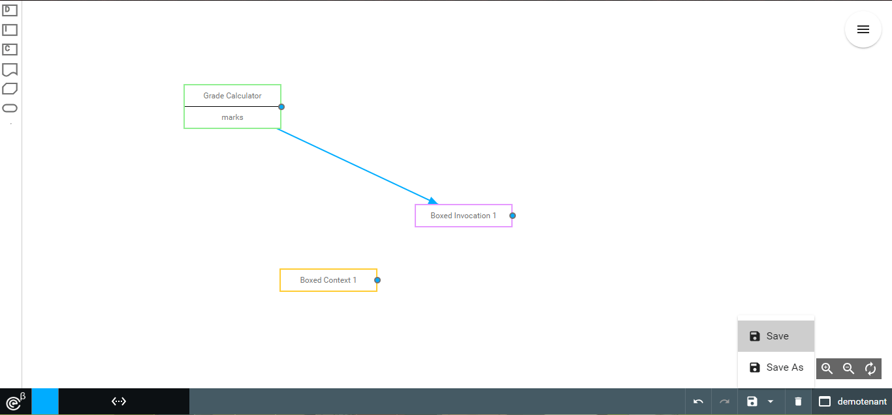
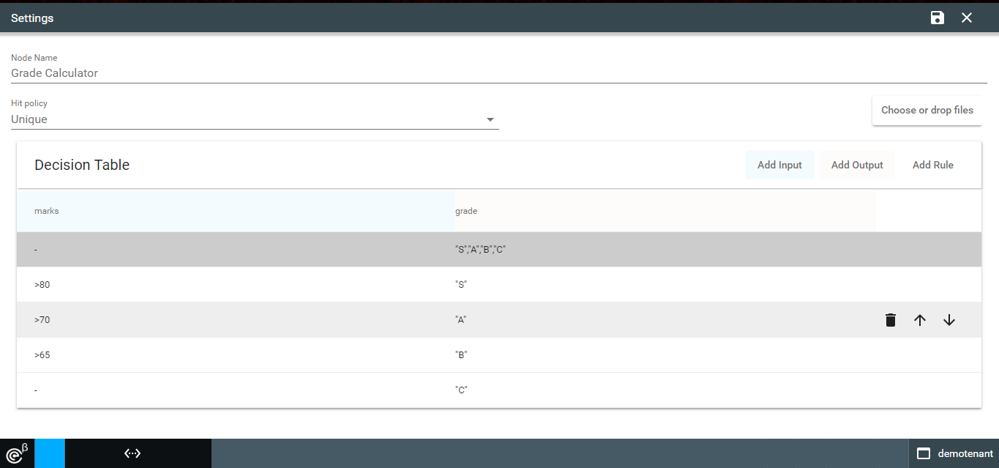

# ***OE FEEL Designer***

It is a plugin for oe-studio that helps to create and manage decision graphs.

Here is the Landing Page.

## ***Decision Graph Creation***
Click on `Select Decision graph` which will show the existing list of decision graphs and new graph can be created by clicking on `Create Decision graph` button under the options part on the right.

Upon clicking , a blank graph will be created and displayed as shown below.

The bottom Panel will now display options to undo/redo graph change , save and delete the graph.

The Left side lists the components/nodes that can be dragged and dropped into graph.Each components will display differently based on their type.

These components can be moved around as needed within the graph.The entire graph can be panned or zoomed as per preference.The final icon near the zoom icons will reset the Pan and zoom to initial state.

#### **Create connection**
To create a connection between two nodes drag the blue circle at the end of node and connect it to its target. Once connected the designer will show a dialog box with available connection type.

Once confirmed the connection will be drawn on the graph.Cyclic connections are prevented in the graph.

The appearance of connection will vary based on the connection type. The connection may be edited by clicking on it to launch the dialog where it can be removed.

#### **Save graph**
Once the graph is created it can be saved by clicking on the save button on the bottom bar.

Enter the name for the graph in the dialog box that appears and click on `save` button to save the graph.

#### **Node settings**
Hovering over a node displays options to `select node`,`launch setting` and `delete node` . 
Deleting a node deletes all the connections to and from the deleted node.

Clicking on the `launch setting` icon will display a configuration page for the node. The Configuration page allows user to change the node name and configure other properties based on the node type. The below is an example for a Decision Table node.

For decision table the rules are listed in a data-table with buttons to add input,output columns and a  rule. The names of the columns or the values in the row can be edited inline.

Hovering over a rule record allows the user to move the rule up/down the rule list and also to delete the rule.

> In addition to entering the rule data , the user can upload a valid Decision Table Excel using the `choose or drop files` file uploader button to populate the rulelist and hitPolicy. __Note__ : The Name of the decision Table will not be updated from the file and needs to be manually changed.

Once all the settings are done click on the `save` icon at the top right of the page to return to the design view.

#### **Node selection**
On selection of a node, the node is highlighted and additional options are shown in the floating button to the top right of the screen.

Clicking on the `play` button allows the user to simulate the node using a payload and view the output.

Clicking on the `plus` button launches the add to service dialog , where the selected nodes can be saved as a Decision Service after entering the name.

The list of decision services associated with the current graph can be viewed by clicking on the floating-button.

From here a service can be selected,edited or deleted. Once the service is selected the related nodes are highlighted and the service name appears near the floating button.

## ***Decision table Creation***
Click on `Select Decision graph` which will show the existing list of decision graphs, clicking on the Decision Table section in left displays the list of decision Tables available. A new decision Table can be created by clicking the `Create Decision Table` button under the options part on the right.

This launches the decision Table editor used when editing the decision graph nodes, The user can enter the data or upload a valid Excel that populates the rules list and Hit Policy. Once the decision Table name is also configured the user can press the save icon on the top to save the Decision Table.

